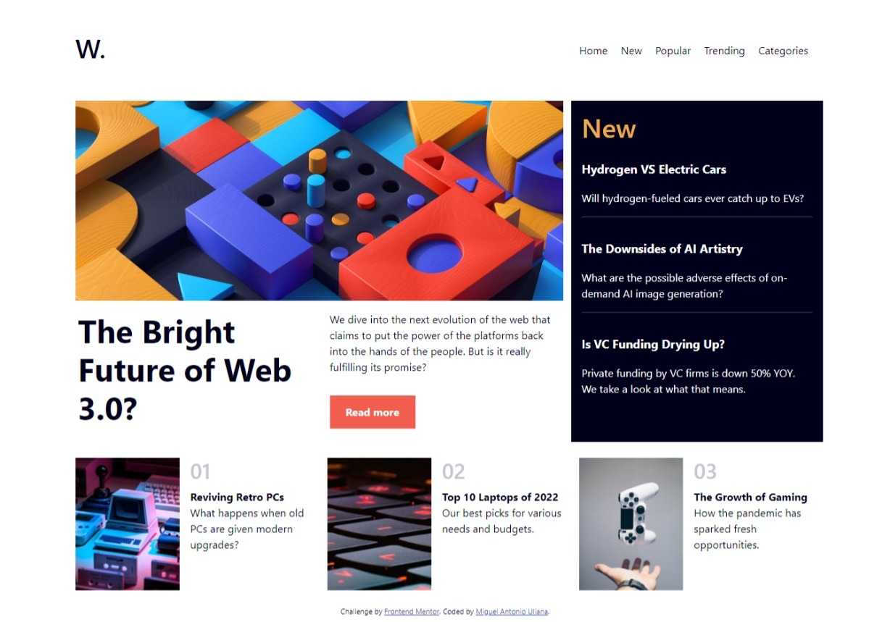

# Portfolio De Miguel Antonio Uliana
 
Projeto 1 

Criado utilizando HTML e CSS além da biblioteca do framework Bootstrap 5
Site criado a partir do design do site <a href="https://www.frontendmentor.io/challenges/news-homepage-H6SWTa1MFl/hub/news-homepage-OL8LUMmE0O">Frontend Mentor</a>
O site possui responsividade para telas acima da largura de 768px

Link do projeto: <a href="https://barususubaru.github.io/PortfolioDeMiguelAntonioUliana/news-homepage-main/index.html">News Homepage</a>

